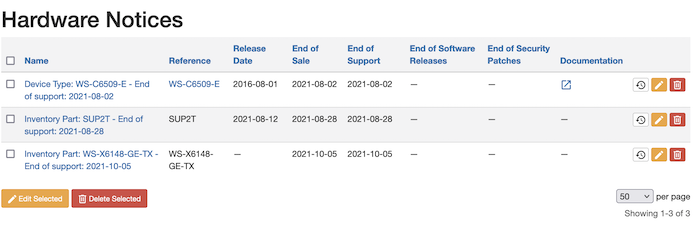
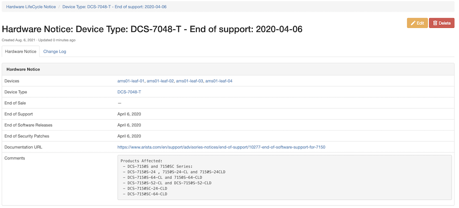
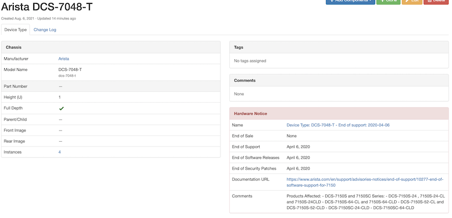

# Nautobot Plugin - Device Lifecycle Management

A plugin for [Nautobot](https://github.com/nautobot/nautobot).

## Installation

The plugin is available as a Python package in pypi and can be installed with pip

```shell
pip install nautobot-plugin-device-lifecycle-mgmt
```

> The plugin is compatible with Nautobot 1.0.0b1 and higher

To ensure Nautobot Device Life Cycle Management plugin is automatically re-installed during future upgrades, create a file named `local_requirements.txt` (if not already existing) in the Nautobot root directory (alongside `requirements.txt`) and list the `nautobot-plugin-device-lifecycle-mgmt` package:

```no-highlight
# echo nautobot-plugin-device-lifecycle-mgmt >> local_requirements.txt
```

Once installed, the plugin needs to be enabled in your `configuration.py`

```python
# In your configuration.py
PLUGINS = ["nautobot_plugin_device_lifecycle_mgmt"]
```

## Usage
### Hardware LifeCycle Management
#### API


## Contributing

Pull requests are welcomed and automatically built and tested against multiple version of Python and multiple version of Nautobot through TravisCI.

The project is packaged with a light development environment based on `docker-compose` to help with the local development of the project and to run the tests within TravisCI.

The project is following Network to Code software development guideline and is leveraging:

- Black, Pylint, Bandit and pydocstyle for Python linting and formatting.
- Django unit test to ensure the plugin is working properly.

### CLI Helper Commands

The project is coming with a CLI helper based on [invoke](http://www.pyinvoke.org/) to help setup the development environment. The commands are listed below in 3 categories `dev environment`, `utility` and `testing`. 

Each command can be executed with `invoke <command>`. All commands support the arguments `--nautobot-ver` and `--python-ver` if you want to manually define the version of Python and Nautobot to use. Each command also has its own help `invoke <command> --help`

#### Local dev environment

```no-highlight
  build            Build all docker images.
  debug            Start Nautobot and its dependencies in debug mode.
  destroy          Destroy all containers and volumes.
  restart          Restart Nautobot and its dependencies.
  start            Start Nautobot and its dependencies in detached mode.
  stop             Stop Nautobot and its dependencies.
```

#### Utility

```no-highlight
  cli              Launch a bash shell inside the running Nautobot container.
  create-user      Create a new user in django (default: admin), will prompt for password.
  makemigrations   Run Make Migration in Django.
  nbshell          Launch a nbshell session.
```

#### Testing

```no-highlight
  bandit           Run bandit to validate basic static code security analysis.
  black            Run black to check that Python files adhere to its style standards.
  flake8           This will run flake8 for the specified name and Python version.
  pydocstyle       Run pydocstyle to validate docstring formatting adheres to NTC defined standards.
  pylint           Run pylint code analysis.
  tests            Run all tests for this plugin.
  unittest         Run Django unit tests for the plugin.
```

## Screenshots

### Hardware: Device Life Cycle Management List View

You can view the list of Hardware/Software notices as well as filter the table.



### Hardware: Device Life Cycle Management Detail View

You can also click a Hardware/Software Notice and see the detail view. This view provides links to the devices that are part affected by this EoX notice due to their device type.



### Device View

You can also view the associated Hardware notice from the device. If the device is end of life or end of supoort the notice will be red.


### Device Type View

This provides the same UI element as the device view, but within the specific device type's view.

